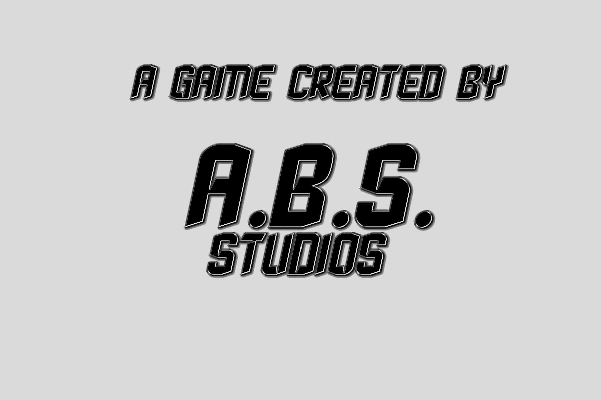

# Toofia_Version_0.26.35
:gear: **The main repo for the game, written in [GDScript](https://docs.godotengine.org/en/3.5/tutorials/scripting/gdscript/gdscript_basics.html) and made in [Godot Engine](https://godotengine.org/)**

:writing_hand: ***Tags: educational games, preschoolers, 2D, GDScript***

:label: **Game Title:** *Toofia: Kasangkapang Tulong Pang-edukasyon*

:desktop_computer: **Language Used:** *GDScript*

:hourglass_flowing_sand: **Progress:** *45% out of 100%*

:dart: **Completed Goal:**
- [x] Add a Persistent Music system that persists even when restarting the game.
- [x] Added Name Input and store it locally
- [x] Added 1 Level with Two Questions
- [x] Added, Modified and Fixed the Reapeat Button of the Question by pressing the image
- [x] Add the Blocks of Time's level selection
- [  ] 
- [  ]
- [  ]
- [  ]
  
:pushpin: **Next Goal:**
- [  ] Add a system logic that makes the star display 1, 2 or 3 stars based on the players choice
- [  ] Implement this system to other levels :face_with_spiral_eyes:
- [  ] Add more questions to Levels :dizzy_face:
- [  ] TLDR;
- [  ] Finish the game.. :tada:
- more to come...

 

:package: **Download the Source File**
- :arrow_right: Download [Here](https://github.com/Moggle-Khraum/Toofia_Version_0.26.35/archive/refs/heads/main.zip)  
 

:raising_hand_man::grey_question: **About the Game** 

    <b>The Toofia Game's Icon:</b>&emsp; &emsp; &emsp; &emsp; &emsp; &emsp; &emsp;<b>Made with Godot Engine</b> &emsp; &emsp; &emsp; &emsp; &emsp; &emsp;<b>Made By ABS Studios</b> 
     &emsp; &emsp; &emsp; &emsp; &emsp;  &emsp; &emsp; &emsp; &emsp; &emsp; 
     

    
